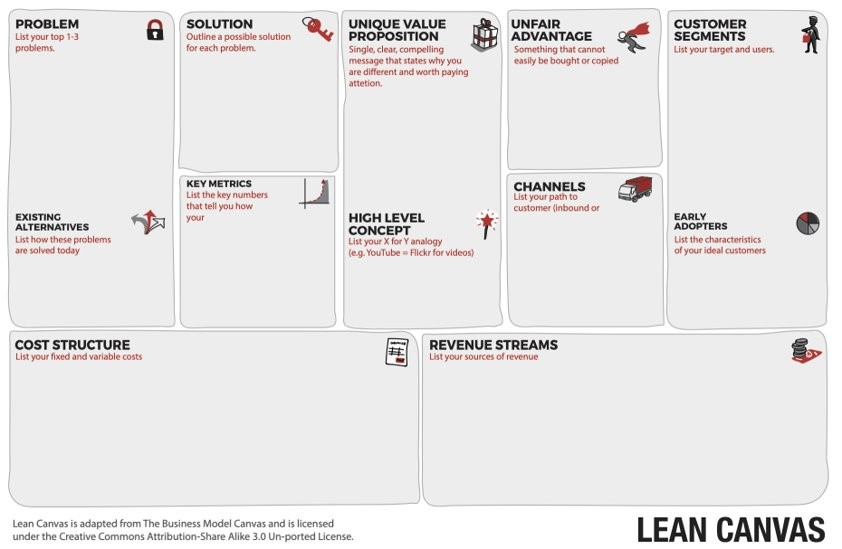

My 2021 was primarily focused on training an innovator mindset. 

Since I have started as a self-taught developer at 16, I have spent almost a decade learning how to build solutions. I was in the inventor’s mindset of *“Build it and they will come”*. This is the default setup everyone has in the first place. I have not yet met a successful founder who has not started and failed this way at least once in the beginning. Unfortunately, it takes a lot more than building an MVP over a weekend to **make something people want**. And there is no way to learn it on paper. You have to go down to the arena. That’s why [I quit my job](https://ittaboba.com/article/quit-my-job) in March 2021 and started this journey working on [Gems](https://gemsnotes.app/).

## Things learned
It would actually take a whole book to explain all the things I have learned in 2021. And I would have liked to write a few posts if I had the time. My apologies, it has been a very busy year. I will catch up on this at some point. In the meantime, here are some highlights:

### SEO blogging 
In the first quarter of the year, I focused on learning the basics of SEO. I joined this [great community](https://bloggingfordevs.com) managed by [Monica](https://twitter.com/monicalent) who taught me both [technical SEO and how to structure a content plan](https://golden-workshop-ecc.notion.site/SEO-7099bc7610a649beb385b712a74e5e77). I have applied the learnings on this same website and on the [blog section of Gems](https://gemsnotes.app/blog/). In this second case, since it’s blogging for business, I followed this [great course](https://ahrefs.com/academy/blogging-for-business) by Ahrefs too. Here you can find my [main takeaways](https://golden-workshop-ecc.notion.site/Blogging-for-business-a4cb0d9b1c27438bafaf2fbfd8b2bd1a). 

If you have a business, SEO blogging is very powerful. Once you rank at the top on Google search results, you constantly have the unfair advantage of being the very first one to give a solution to your prospects when they need it most. If you [understand your customers](https://golden-workshop-ecc.notion.site/When-is-the-worst-time-of-year-to-run-ads-for-new-homes-8d13092ab5d44975b4bd4f819cc653ac) well enough, you can basically cut off your competition for free. 

Of course, this is much easier said than done. You have to publish consistently. You have to find keywords that you can compete for. But more importantly, you have to build backlinks to your website to increase Domain Authority which is what really matters to search engines. It takes months to be ranked by Google. And finally, even assuming you have all these things in place, your content needs to be original, provide value to visitors, and be well connected with what you offer to get your chance to convert them. Otherwise, you just get a lot of traffic that slows down your page. 

Even masters like Monica can struggle a lot for [her own admission](https://twitter.com/monicalent/status/1467438142609408000). As I said, I didn't even have time to write a few blog posts in the following months. So I have paused this topic but I am sure this awareness will come in very handy in the future. Thanks Monica!

In April, I joined an online course called [“90-day startup”](https://leanstack.com/training/90-day-startup) led by Ash Maurya, the creator of the Lean Canvas. It made all the difference. Here are [my notes](https://golden-workshop-ecc.notion.site/90-day-startup-68959c7a8d434f5f9ed94420ad2e297d). (You also find a 10% discount referral link on the next cohort). It really takes 3 intense months of workshops, biweekly coaching sessions, case studies, questions in the forum, and most importantly, active work on your idea, to get a real understanding of the material. But here are my 3 main takeaways from the experience:

### Right action, right time
At any given time, there is a limited set of actions you have to take to really move your project forward. Everything else is premature optimization and a form of waste. The course introduced various tactics and frameworks. Taken individually, I already knew most of them. But I didn't know when and how to use them effectively. 

For example, a quite popular tendency in the very early days of an idea is to maximize presence and visibility on communities and social networks. Of course, it depends on the nature of your business, but in the vast majority of cases, it’s a sheer waste of time and money. Unless you have already built a complete funnel that turns unaware visitors into customers, you’ll get plenty of prospects on your landing page with no chance to bring any of them to the finish line. 

Sounds reasonable, yet it's usually the second move people make (myself included) right after building an MVP, which is actually not even the right first move.

I now feel much more deliberate in making the few decisions that best suit the stage I am in.

### Discovery before validation
It’s quite common to build an MVP to validate assumptions. I did it multiple times. Sometimes it works but it’s a suboptimal approach. A better approach I have learned and practiced this year is:
1. Talk to people to understand their worldview (e.g. *What tools do they use? What do they use them for? Are they paying for them? Why did they switch to a competitor?* etc.)
2. Formulate some hypotheses around their problem and design a potential solution
3. Wait to build it until you have found some people who pre-order it

I have found my very first customers via calls by explaining to them the problem I was solving and showing this very simple mockup assembled directly in Google Slides. 

As you can imagine, I didn’t get it right immediately. The first calls were quite frustrating. Imagine going through the same process on a working product instead of a mockup that you can change in 5 minutes. Feedback loops are going to be much longer and expensive. In today’s world, **market risk is usually bigger than technological risk and needs to be tested first**. 

### The business model, not the solution, is the product
As you can see from the [Lean Canvas](https://golden-workshop-ecc.notion.site/Lean-Canvas-3b92aae4d47b4241942d7b39722976c9) picture below, the solution is only a small part of the whole picture, and to make it work you need to focus on the problem, channels, early adopters, and many other aspects. Each has its own complexities and varies according to the maturity of the business.

For example, I learned that the ideal [early adopter profile](https://golden-workshop-ecc.notion.site/Early-adopter-criteria-6d5fd35f66804b5080cdf29502fd2c56) must be based on *where they are* in the customer journey rather than *who they are*.

The worldview of someone who has just started blogging is very different from that of someone who has been publishing consistently for years. They are both bloggers. But the former is probably testing multiple tools for the first time to get started. The latter might complain about some missing features to do a specific task. Their maturity level is very different, so the way they look at solutions is very different too. You have to choose who to go after.

At some point, you begin to deal with different worldviews within your own product too. Assuming you decide to target novice bloggers, your established customer base becomes more sophisticated with usage while the people who find your landing page for the first time are still at the beginning of the [customer timeline](https://golden-workshop-ecc.notion.site/JTBD-timeline-963dc97617b74cf2bef384dcf01a0ed5). So you need to constantly check that both acquisition and retention are connected with your target.

The solution is in function of many different dynamic variables, each corresponding to a box on the canvas. And the canvas itself is the real product. This is the key point that allowed me to go from an inventor focused on the solution to an innovator focused on [traction](https://golden-workshop-ecc.notion.site/Traction-is-the-Goal-09239d24fde344afaa740cc97c30427a).

### Successful ideas must be at the intersection of timing, domain expertise, and team strengths
Even once you have found an idea with traction, it doesn’t necessarily mean it’s going to be a success. You also need a mix of:
1. **Timing**, to find a large enough market ready to understand and embrace it. Answer the questions *“What is changing in people's habits and needs?”*, *“Why now?”*. The pandemic has changed many things and this is the perfect time for ideas that might have sounded crazy before.
2. **Domain expertise**, to provide unconventional answers to the *“Why now?”* and have enough inside knowledge to be constantly one step ahead of the competition.
3. **Team**, to execute fast. Each member with the right skillset and interest in the problem you solve. 

This is a consideration rather than learning. It's a topic I'll focus on in 2022.

## Things to celebrate
I think to have much stronger foundations on the market side. I got there with the right balance of theory and practice, and the support of some great mentors along the way. Thanks Ash and the coaches! There is still a lot to learn, but having found customers by myself is a huge accomplishment for my self-awareness. I feel like I've unlocked a difficult level of a video game. It's tricky only the first time.

I improved on the tech side too. Gems MVP was quite challenging to build. Thanks to my friends for the support on the most critical decisions.

## Memories
It’s been almost 2 years since I last left my region or made a holiday. I chose to stay heads down on my work waiting for better times to move. This means I don't have many remarkable life experiences to remember this year. 

However, some unforgettable moments came from sports events. Being in Italy when the national soccer team [wins a European](https://youtu.be/lPjmLCs2ung) or a World Cup is an experience anyone should try at least once in their life. Since then, the Italians have won everything. It has been a flood of emotions. But the most unforgettable day of my 2021 was August 1st. [Gianmarco Tamberi](https://en.wikipedia.org/wiki/Gianmarco_Tamberi) and [Marcell Jacobs](https://en.wikipedia.org/wiki/Marcell_Jacobs) did in 15 minutes what generations of athletics fans like me could not have imagined seeing in a lifetime: Olympic gold medals in the [high jump](https://youtu.be/QFY0GIC-69A) and [100 meters](https://youtu.be/cNstaDY6ql8). A few days later, Marcell and the team also won the 4x100m relay with an [epic comeback](https://youtu.be/B7lQ8JxFLTY). 

Their personal stories are the very essence of De Coubertin’s values. And their performances are the very essence of the Olympic motto *“Citius, Altius, Fortius”* (*“Faster, Higher, Stronger”*). Those nights I had a hard time falling asleep. In the youth categories I competed several times with Marcell in the long jump. Unfortunately, that's when I started [getting injured](/about). But I am very grateful and honored for the few chances I had. Thanks Marcell for reminding me that's worth believing in the impossible.

, January 30th, 2011.")

Lastly, thanks to all the people I met virtually this year. Thank you for taking the time to share your experience and enthusiasm with me. It made all the difference.

Have a great 2022!