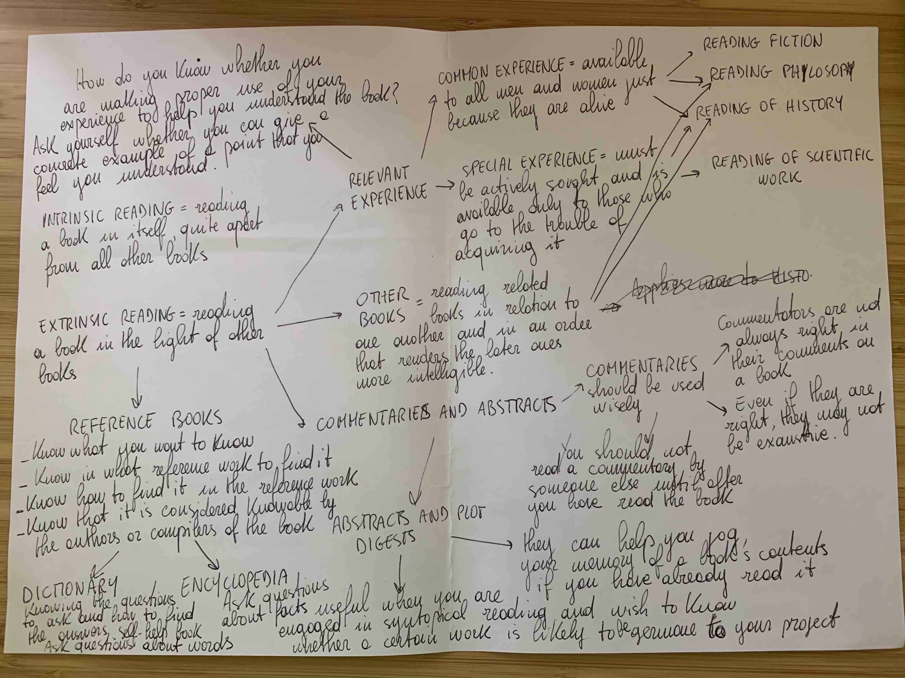

We read all the time. Whether it's an entire book, a blog post, or a tweet, we invest far more time than we think on them every single day.

Reading books is a huge deal. In the worst case, it costs a few dollars and some hours of focused thinking to connect with the imagination of fiction writers and the expertise of non-fiction writers who trained themselves for years. However, to gain [compounding knowledge](https://fs.blog/2019/02/compounding-knowledge/) from the activity, a little more discipline is needed. I found myself too many times reading and forgetting after a while.

In this article, I share my takeaways from ["How to read a book"](https://www.amazon.com/How-Read-Book-Classic-Intelligent/dp/0671212095) by Mortimer J. Adler and Charles Van Doren. I introduce their framework and then show how I take notes to get sustained value from my readings over time.

## Why we read?
First of all, **the goal a reader seeks determines the way he reads**. According to the authors, people always read for one of the following three reasons:
- Information
- Understanding
- Entertainment

When **reading for information**, the reader gets more facts and understands them in the same light. For example, we usually don't read newspapers and magazines to be challenged with new insights. Rather to keep us informed on the latest facts.

When **reading for understanding**, the reader gets new light on all the facts he already knows. He is learning something by challenging his beliefs. To make it possible, two conditions must be met:
1. There is *initial inequality in understanding* between the writer and the reader. The former communicates something that the latter is unaware of
2. The reader must be able to *overcome this inequality*. In the end, the reader must know what the author says, but also what he means and why

**Reading for understanding is reading for learning**. However, learning from books is very different than learning from teachers. In school, the teacher gives a path to follow and provides support in the most difficult passages. **Books are absent teachers**. We have to find questions and answers by ourselves. Great authors make it easier for readers to find their way. But still, to get the most out of their help, we need to know what to look for. 

The ability to learn from books is particularly important in today's world. The school covers a small fraction of our journey of growth. For most of our life, education depends on books alone. Therefore, lifelong learners must know how to make books teach them well.

## The 4 levels of reading
The first step to improve reading skills is to know the differences between the 4 levels of reading:
- Elementary reading
- Inspectional reading
- Analytical reading
- Syntopical reading

You can use the following points as a checklist during your next reading.
 
### Elementary reading
This is the first level usually learned in elementary school. 

The primary goals are to recognize the written symbols on the page and answer the question *“What does the sentence say?”*. 

Sometimes we encounter problems even at this first level. For example, if we are reading something written in a foreign language that we don't know very well. 

Elementary reading is made by four stages:
- Stage 1: **reading readiness** to speak clearly and to use several sentences in the correct order (pre-school & kindergarten)
- Stage 2: **word mastery** to read simple books independently (first grade)
- Stage 3: **vocabulary growth & utilization of context in finding the meaning of unfamiliar words** to read for different purposes and in different areas of content such as science, history, arts etc. (fourth grade)
- Stage 4: **refinement & enhancement of the skills** to assimilate reading experiences and to compare views of different writers on the same subject (8/9/10th grade)

By the end of the fourth stage, the reader can read and get the basic meaning of almost anything. We achieve this level with the help of school teachers who make us ready to move on to the next levels.

### Inspectional reading
The second level is about getting the most out of a book quickly and answering the questions: 
- *"What is the book about?"*
- *“What kind of book it is?”*
- *“What is the structure of the book?”*

This is useful for students if they have a short deadline but also at the bookstore to decide if the book is worth the investment. Sometimes even the ebooks preview is quite comprehensive for this type of exercise. 

There are two stages of inspectional reading:
- **Systematic skimming or pre-reading** to discover if the book requires a more careful reading. Here are some things you can do:
	1. Look at the title page and its preface
	2. Study the table of contents
	3. Check the index
	4. Read the publisher's blurb
	5. Look at the chapters that seem pivotal to the book argument
	6. Read some pages (at the end of the chapters you may find the key concepts summarized in a bullet list or in the last paragraph)
	
	The process should take between a few minutes and an hour. If you find the book does not deserve more time and attention, you can stop here.
- **Superficial reading** to get familiar with the main concepts and see the big picture without focusing too much on the most complex passages. Pay attention to what you can understand and don't be stopped by what you cannot immediately grasp. For difficult books, more than one reading is usually needed. 

Many people underestimate the importance of achieving superficial knowledge of the book before committing to it more seriously. They usually skip this level and start reading for understanding, which is more difficult and sometimes turns out to be useless. 

Furthermore, both stages of the inspectional reading anticipate some of the steps needed in analytical reading. Specifically, **systematic skimming** anticipates the **comprehension of a book's structure**. **Superficial reading** is the first necessary step in the **interpretation of a book's contents**.

Lastly, inspectional reading helps to prepare for syntopical reading too. You can use it to quickly understand if a book says something important related to your subject matter or research. In this age of information overload, this is probably the most important skill to have. Analytical reading is a demanding task and you can probably only handle a few of these readings per year. The ability to cut down your bibliography to a more manageable size by filtering out noise and focusing on what matters most is increasingly important. Inspectional reading helps you do that.
   
### Analytical reading
If the second level is about getting a taste of the whole work, the third level is about digesting the information. The reader asks questions about what it is read.

Analytical reading takes most of the time and energy that are worth investing only if you are reading for understanding. If your goal is to read for information or entertainment, this is not necessary.

There are three set of rules to follow to read analytically:
- Rules for finding what a book is about and outline its structure
- Rules for interpreting a book's contents and messages
- Rules for criticizing a book (must always follow the other two in time)

#### Rules for finding what a book is about and outline its structure
1. Know **what kind of book** you are reading as early as possible. 
	
	If you've been through inspectional reading, you should know the answer to the following questions even before you start reading:
	- *"Is it fiction or nonfiction?"* 
	- *"Is it practical or theoretical?"*
	
	Theoretical books are focused on communicating knowledge for its own sake. Practical books are concerned with the problems of human life that knowledge can help to solve. It's important to know what kind of book you are reading because it changes the way you read it. If it's **theoretical**, questions are about the **validity of something**. If it's **practical**, questions are about the **purposes it serves**.
	
2. Say **what the book is about** as briefly as possible, in a single sentence or at most in a short paragraph. Find the essence of the plot, everything else is episode.
	
	Sometimes the author tells you in the preface. This is particularly true for scientific or philosophical writers who have no interest in keeping you in suspense. Rather they want to make their point clear as soon as possible to help you follow them in their work.
	
3. **Find the major parts** and see how they are **connected** together as a whole. Make an outline or a mind map with the key concepts.
	
	Your structure might differ from the author's structure indicated in the chapter divisions. That's fine. Use them as guides for your own activity and not rely on them passively. 
	
	By following this rule, sometimes I start my reading from the end of the book or in the middle. I jump back and forth between chapters. I find it useful to establish a conversation with the author rather than listening to a monologue.
	
4. State the **main questions** that the book tries to answer. 
	
	The writer may state his questions and answers more or less explicitly. In both cases, it's your task as a reader to formulate the questions as precisely as you can. Here is a list of *frequently asked questions* in the pursuit of theoretical and practical knowledge:
	
	Theoretical questions
	- *"Does something exist?"*
	- *"What kind of thing is it?"*
	- *"What caused it to exist, or under what conditions can it exist, or why does it exist?"*
	- *"What purpose does it serve?"*
	- *"What are the consequences of its existence?"*
	- *"What are its characteristic properties, its typical traits?"*
	- *"What are its relations to other things of a similar sort, or of a different sort?"*
	- *"How does it behave?"*
	
	Practical questions
	- *"What ends should be sought?"*
	- *"What means should be chosen to a given end?"*
	- *"What things must one do to gain a certain objective, and in what order?"*
	- *"Under these conditions, what is the right thing to do, or the better rather than the worse?"*
	- *"Under what conditions would it be better to do this rather than that?"*

#### Rules for interpreting a book's contents and messages
1. Find the important **words** and come to **terms** with the author.
	
	A word is ambiguous. The dictionary is full of words with many meanings. A term in a word used unambiguously. Reader and writer must agree on the meaning of a word to communicate and understand each other. They must come to terms.
	
	How to find important words:
	- remove ordinary words and focus on those that cause you trouble and are not ordinary for you
	- look for quotation marks or italics provided by the author
	- look for explicit explanation of word usage

	To discover the meaning of a word you do not understand, use the meanings of all the other words in the context that you understand. This is what usually happens with definitions: you operate with meanings you already possess to acquire a new meaning. 
	
2. Mark the most important **sentences** in a book and discover the **propositions** they contain
	
	Words are to terms as sentences are to propositions. A sentence is a sequence of words. The same sentence can express different propositions if there is a shift in the terms the words express. 
	
	> “"Reading is learning" is a simple sentence; but if at one place we mean by "learning" the acquisition of information, and at another we mean the development of understanding, the proposition is not the same, because the terms are different. Yet the sentence is the same.”
	>
	> — "How to read a book", Mortimer J. Adler and Charles Van Doren

	However, not every sentence expresses a proposition. Some sentences express questions. They state problems rather than answers. *Propositions are the answers to questions*. They are declarations of knowledge or opinion by the author.
	
	How to find important sentences:
	- sometimes the author marks them explicitly
	- if you have already marked the important words, they must be part of sentences that deserve further attention and vice versa
	- pay attention to the sentences that you don't understand readily
	
	The best test to know if you have understood the proposition of a sentence is to express it in your own words. 
	> “If you cannot get away at all from the author's words, it shows that *only words* have passed from him to you, *not thought or knowledge*. You know his words, not his mind.”
	>
	> – "How to read a book", Mortimer J. Adler and Charles Van Doren
	
	Foreign readers like me have a small advantage because they are forced to translate what they read to get the meaning. 
	
3. Locate or construct the basic **arguments** in the book by finding them in the connection of sentences.
	
	An argument can be expressed:
	- in a single complicated sentence
	- in multiple sentences that are part of the same paragraph
	- in multiple sentences that are part of multiple paragraphs
	
	This means that sometimes you need to construct the arguments by putting together a sequence of scattered sentences. After you have discovered the leading sentences, the construction of paragraphs should be relatively easy. You can write a note with the propositions that together form an argument, or highlight them in the text and put numbers in the margin.
	
	Furthermore, a good book usually summarizes the arguments at the end of sections and chapters. If you have inspected it before reading analytically, you should already know where they are and use them to interpret the rest of the book.
	
4. Find out what the **author’s solutions** are
	
	In the last step at the previous stage, you focused on the main questions the author tries to answer. Now that you have come to terms with him and found his key propositions and arguments, is time to formalize the actual answers and ask further questions: 
	- *"Which of the problems that the author tried to solve did he succeed in solving?"*
	- *"In the course of solving these, did he raise any new ones?"*
	- *"Of the problems he failed to solve, old or new, which did the author himself know he had failed on?"*

#### Rules for criticizing a book (must always follow the other two in time)
1.  You must be able to say, with reasonable certainity “I understand”, before you can say any one of the following things:
	- I agree
	- I disagree
	- I suspend judgment
	
	> “To agree is just as much an exercise of critical judgment on your part as to disagree. You can be just as wrong in agreeing as in disagreeing. To agree without understanding is inane. To disagree without understanding is impudent. Though it may not be so obvious at first, suspending judgment is also an act of criticism. It is taking the position that something has not been shown. You are saying that you are not convinced or persuaded one way or the other.”
	>
	> — "How to read a book", Mortimer J. Adler and Charles Van Doren

2.  When you disagree, do so reasonably
	
	Once you have said *"I understand but I disagree"*, you can say one of the following things to the author:
	- *"You are **uninformed**"*
	- *"You are **misinformed**"*
	- *"You are **illogical**"*
	- *"Your analysis is **incomplete**"*
	
	Of these four, the first three are criteria for disagreement. If you can't say any of them, you must agree, at least in part, or suspend judgment in the light of the last point. Of course, when doing so, you always must be able to back up your claims, which introduces the last rule.
	
3.  Respect the difference between **knowledge** and mere **personal opinion** by giving reasons for any critical judgment you make

	> “Knowledge, if you please, consists in those *opinions that can be defended*, opinions for which there is evidence of one kind or another. If we really know something, in this sense, we must believe that we can convince others of what we know. Opinion, in the sense in which we have been employing the word, is unsupported judgment”
	>
	> — "How to read a book", Mortimer J. Adler and Charles Van Doren
	
### Syntopical reading
This is the fourth and highest level. Another name for it might be *comparative reading*. The reader reads many books and places them in relation to one another and to a subject about which they all revolve. Furthermore, the syntopical reader is able to construct an analysis of the subject that may not be present in any of the books.

As mentioned before, inspectional reading is particularly helpful to quickly find potential **connections** between books without reading all of them analytically. Otherwise, the process would take years. Once you have identified the books that are relevant to your subject matter, you can then proceed to read them syntopically.

There are five steps in syntopical reading:
1. Find the relevant passages
	
	This step requires another inspectional reading session. But this time you no longer focus on whether the book is relevant to your work. Rather you look for its most relevant passages according to your needs. In fact, it's quite unlikely that everything is relevant for you. 
	
	Unless you are very skillful, you should keep the inspectional reading to find *relevant books* separated from the inspectional reading to find *relevant passages*.
2. Bring the authors to terms
	
	This is probably the most difficult step. You need to establish a unified language across different books and authors that use different *terms*. In analytical reading, you came to terms with the author. In syntopical reading, authors need to come to terms with you. 
3. Get the questions clear
	
	The same thing happens with propositions. You need to ask yourself questions that each author can answer with his propositions. This is hard too. Sometimes they don't give an answer or they don't even see your question as such. 
	
	Again, in analytical reading you looked for the author's problems and questions and tried to understand his answers before agreeing, disagreeing, or suspending judgment. In this case, you bring your own problems and questions and seek answers from the authors.
4. Define the issues
	
	Of course, different authors may provide contradictory answers to your questions. Most of the time, contradictions are due to *different conceptions of the question* or *different views of the subject* each author might have. The real issue is when two or more authors understand the question in the same way and provide contradictory answers, but it rarely happens. 

5. Analyze the discussion
	
	When we have many different views available, it's not enough to ask and answer the questions. Truth must be sought into the *contrast of opposing answers*. We need to ask questions and get answers in a certain order, being able to explain the why and the how of such decisions. 
	
Funny enough, the most effective way I know to achieve syntopical reading is by writing. These five steps happen almost automatically when you try to write about your subject. Writing forces you to put ideas in order (step 5) and find contradictions in your thinking quickly (step 4). If you ask many writers, they'll tell you that the quality of their writing depends on the quality of their questions more than the quality of their answers (step 3). It's quite obvious that you need to choose your words and terms to write your piece (step 2) and decide what to focus on (step 1). 

Syntopical reading is the most active reading you can do. Analytical reading is also active, but in that case, you approach the book as a disciple that learns from a master. In syntopical reading, you become the master. You look for answers to your questions, whether it is for learning or creating something new. 

## How to take notes while reading a book
> “Reading a book on any level beyond the elementary is essentially an effort on your part to ask it questions (and to answer them to the best of your ability)”
>
> — "How to read a book", Mortimer J. Adler and Charles Van Doren

The 4 levels of reading provide a solid framework to get to the right questions and answers systematically. However, as we have just seen, multiple steps and stages are involved. We are unlikely to handle the whole process in our heads. For this reason, it is essential to complement the thinking process with some notes. 

I like to distinguish between **note-taking** and **note-making**. The former occurs during the reading or immediately after. The goal is to keep the most important parts of the book or personal thoughts without interrupting the reading flow. The latter usually happens a couple of days later and might go through multiple iterations over time. This is where the questions of each level of reading meet their answers.

### Note taking without interrupting the reading flow
I always have a pencil in my hand and a blank sheet near me when I read. I try to keep as much as I can within the book with the help of:
- Underlines
- Vertical lines at the margin
- Stars, asterisks at the margin
- Numbers in the margin
- Numbers of other pages in the margins
- Circles of key words or phrases
- Short notes in the margin, or at the top/bottom of the page

I don't have specific meanings for all of these signs. I just use them as placeholders for important spots I want to go back to. If it's an ebook, options are limited to highlights and notes. Personally, I am not a huge fan of ebooks as they are not very handy to use. 

Furthermore, at the end of each chapter, I pause and jot down on the sheet of paper the main concepts and their relationships. As I read, I refer to the map and extend it with the new concepts of the other chapters. This makes it easier for me to write my permanent notes later and to orient myself within the book when looking for answers. Since it's a map, I don't have to worry about any order and I can also start reading from the last chapter if I want.

### Note making to answer the questions
Each level of reading poses different questions. Adler and Van Doren defined different types of notes accordingly: 
- **Structural notes**: questions answered by inspectional reading are about the structure of the book
- **Conceptual notes**: questions answered by analytical reading are about the truth and significance of the book (the author's concepts). 
- **Dialectical notes**: questions answered by syntopical reading are about the discussion between the authors and you

I usually write [atomic notes](/article/creativity-factory) and I find the above distinction particularly helpful. I start from the standard questions provided in the previous sections and try to answer them with the notes and the map I took while reading. Then I integrate them with more sophisticated questions and I keep the structural, conceptual, and dialectical notes in [Gems](/article/gems). This is especially helpful to read and think syntopically.