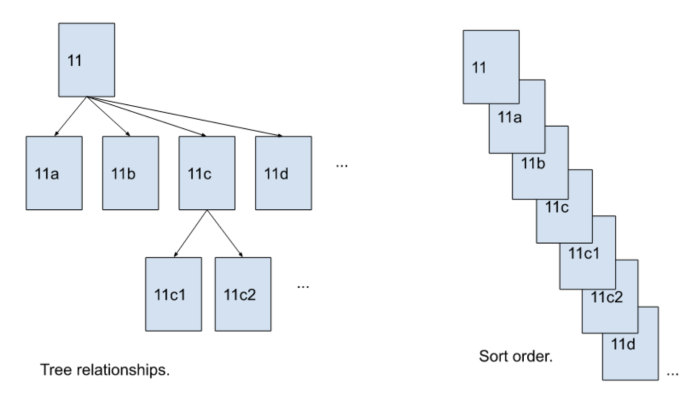

Identifying unexpected and original relationships has become a competitive advantage in many professions. The highly dynamic and unpredictable environment we live in makes **personal knowledge management** and **non-linear thinking** powerful tools to embrace complexity. To make the most of them, we need to **process** and **organize** information differently. In this article, I describe a method called **Zettelkasten**.

## What is personal knowledge management (PKM)?
Personal knowledge management (PKM) is a set of processes to acquire new information and generate new understanding over time. 

PKM tools are used to *gather*, *classify*, *store*, *search*, *retrieve*, *create*, and *share* knowledge. These basic operations allow you to brainstorm and develop ideas, integrate external insights into your thinking, and find meaningful connections that lead to original perspectives.

## Linear vs non-linear thinking
**Linear thinking** consists of a sequence of logical steps. The thought process ignores possibilities and alternatives. This makes it very effective for **solving known problems** and **making immediate decisions**. It's also convenient for **communicating ideas clearly** (e.g. Books' outlines).

**Non-linear thinking** takes into account the interactions between multiple concepts and connections in a given problem space. The thought process is exploratory and leads to **unexpected and novel insights** (e.g. Wikipedia hyperlinks).

Linear and non-linear thinking are both useful for different classes of problems. The former is used to rationally deal with known situations, the latter to creatively deal with unknown situations.

## What is Zettelkasten?
Zettelkasten is a German term composed of “Zettel”, which means “note” or “slip of paper”, and “Kasten”, which means “box”. It is a personal knowledge management system used by Dr. Niklas Luhmann, a 20th-century German sociologist known for being very prolific with his publications. The name comes from the notes he wrote on slips of paper and stored in wooden boxes. Luhman's Zettelkasten had two slip-boxes: 

- The **bibliographic slip-box** containing references and brief notes on the content of the literature.
- The **main slip-box** containing personal ideas, comments, and thoughts.

In the early 80s, he wrote an essay called [“Communicating with Slip Boxes”](https://luhmann.surge.sh/communicating-with-slip-boxes) in which he described the system as a **thinking partner**.

> “That slip boxes can be recommended as partners of communication is first of all due to a simple problem about technical and economic theoretical research. It is impossible to think without writing; at least it is impossible in any sophisticated or networked (anschlußfähig) fashion. \[...\] Information is an intra-systematic event. It results when one compares one message or entry with regard to other possibilities. \[...\] This requires the addition of randomness (Zufall) into the system. \[...\] Applied to collections of notes, we can choose the route of thematic specialization \[...\] or we can choose the route of an open organization. We decided for the latter.”

Luhmann used fixed alphanumeric codes to mark each note and reference it from other cards. In this way, he escaped any physical or mental ordering constraints beforehand. 

First, each code embedded the meaning of the connection used for the internal branching and growth of an idea. 

e.g. A slip with the number 57/12 could then be:
- **continued** by 57/13, etc.
- **supplemented** at a certain word or thought by 57/12a or 57/12b, etc.
- **complemented** by 57/12a1, etc. 

By itself, this may look like the typical hierarchical folder-tree organization we are all used to. However, since all cards were identified by a fixed code, they could refer internally to each other regardless of their position (anticipating hypertext and URLs). This made a card's physical location less important and introduced the actual openness and randomness needed to turn the slip-box into a thinking partner.

Finally, to make **search** and **retrieval** of notes easier, Luhmann kept:
- a **register of keywords** along with some of the slips codes as references
- the already mentioned **bibliographic slip-box**

These two indexing methods took advantage of how memory recalls ideas, in part with keywords and in part with authors' names.

## How to take smart notes
Sönke Ahrens describes the workflow to build and manage a Zettelkasten in his book *[“How to take smart notes”](https://www.amazon.com/How-Take-Smart-Notes-Nonfiction-ebook/dp/B06WVYW33Y)*. Luhmann used to make 3 types of notes with specific roles:

### Literature notes
When you are reading a book or article always have a pen and a card with you. If you find a piece of information you don't want to forget or think you might use in your writing or thinking, write it down on your card instead of highlighting or underlining. Keep it brief and review it later using your own words rather than copying and pasting. This may take a while but it forces you to test your real level of understanding.

### Fleeting notes
These are all your ideas and inspirations. Whenever you have an interesting thought, take a minute to write it down. Always make sure to have something at hand, whether an electronic device or a notebook, to never miss an idea. At this stage, it's not necessary to be too formal. Fleeting notes only serve to save ideas to be processed later.

### Permanent notes
This is the last and most important step. Go through the notes you wrote at the previous steps and think about how they relate to what you are learning, thinking, researching, etc. The goal is not to passively collect as many notes as possible but to continuously develop and enrich the existing ones by asking yourself:

- *Does this new information contradict, support, or broaden my knowledge?*
- *Can I combine some ideas to generate new ones?*
- *What additional questions and implications do these ideas bring with them?*

With these considerations in mind, you are finally ready to write your permanent note and save it in the main slip-box. Remember to include references such as links and keywords so that you are able to retrieve it in the future. 

Lastly, save the literature notes in the bibliographic slip-box along with another card containing references to the original work on one side and a brief note about its content on the other. Discard the fleeting notes.

")

As your slip-box grows, you reach a critical mass of notes that can be used to make your own works. You can choose the topic with an emergent approach according to the notes and ideas with more momentum. Retrieve the notes relevant to the topic. Follow their internal references and links. Arrange them in a logical order and distill them into an argument. Fill the gaps with additional research. Edit and proofread. 

Linear and non-linear thinking are both involved in this process. Luhmann proved more innovative and prolific than his colleagues thanks to his note-taking system which worked like a [creativity factory](/article/creativity-factory).

## Conclusions
Part of Luhmann's conventions were imposed by physical issues such as card storage. Computers make it convenient to manage some aspects differently. However, the underlying principles that turn slip-boxes into thinking partners are revolutionary. Thanks to Zettelkasten, Luhmann never suffered from writer's block. He has always attributed the reasons for his success as a researcher to it. However, until a few years ago, people believed the system couldn't make that much difference. Also, prior to Ahrens' book, most of the documentation was in German only as were [Luhmann's slip-boxes](https://niklas-luhmann-archiv.de/bestand/zettelkasten/zettel/ZK_1_NB_1_1_V). 

In today's digital world, we are all used to store information into spreadsheets, text files, and folder trees. These basic structures are present since the very beginning in personal computers and have ultimately determined their success. **Zettelkasten emphasizes connection, indexing, and recall over passive and hierarchical content collection**. Furthermore, it is curiously based on two fundamental concepts of AI and computer programming: **modularity** and **links**. As a software engineer and knowledge worker, such a system perfectly resonates with my mental models and daily workflows. I also believe **its principles can unleash a new generation of [cognitive tools](/article/augmented-cognition) that make the creative process a collaborative effort between humans and machines**.