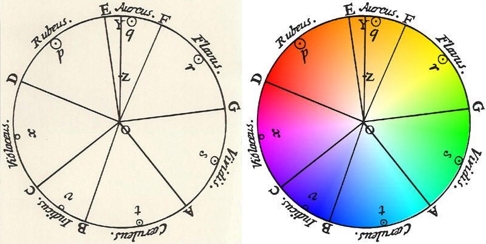
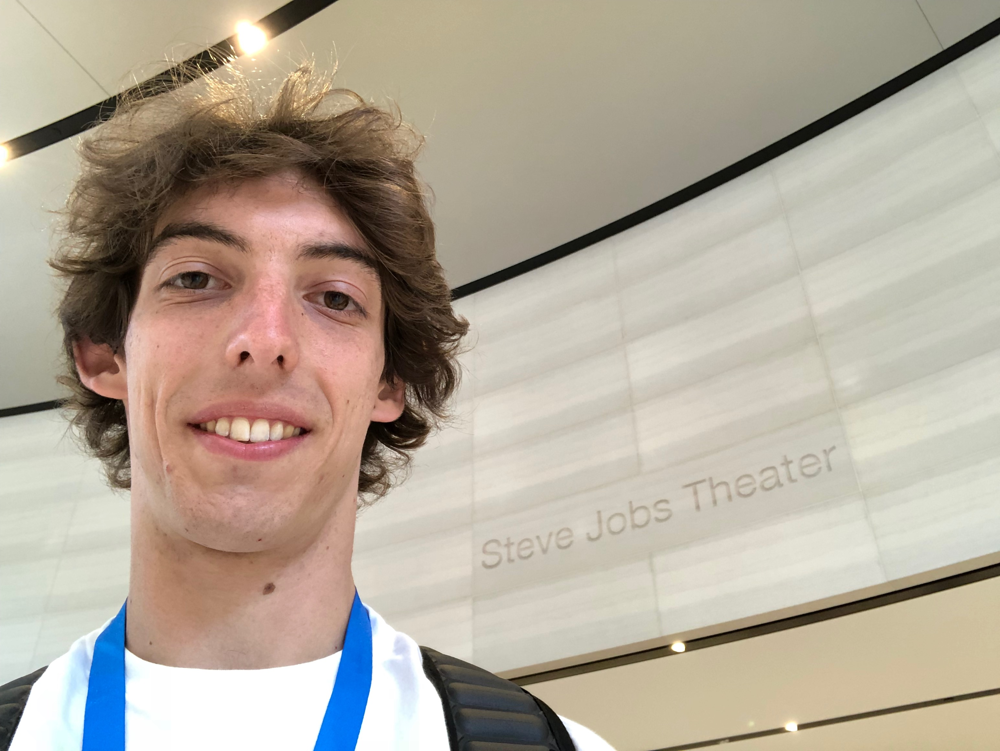

“Dots” is a game based on color theory: the player must mix some of the 9 colored dots to get the background color.

<iframe
    title = "A played example of the three levels “Easy”, “Medium”, and “Hard”. The soundtrack is original and was made by my brother Leonardo who is a very good music composer."
    src="https://www.youtube-nocookie.com/embed/aUtvSrG0mUc?feature=oembed"
    width="560" height="315"
    frameborder="0" 
    allow="accelerometer; autoplay; encrypted-media; gyroscope; picture-in-picture" 
    allowfullscreen
></iframe>

The color theory explains how humans perceive color. In grade school, we learn that colors are organized on a color wheel and grouped into 3 categories: primary colors (Red, Yellow, and Blue), secondary colors (Green, Purple, and Orange) obtained by combining two primaries, and tertiary colors (Magenta, Vermillion, Amber, Chartreuse, Teal, and Violet) obtained by combining one primary with one secondary. This game is based on it. However, colors' nature and the story that led to the just mentioned “Artist's color wheel” is much more articulated. 

In the mid-1600s, **Isaac Newton** discovered that **color is a physical property of light**. All he needed was a prism and sunlight. At the time, it was already known that a prism crossed by white light produces a series of different colors. Nevertheless, scientists had always speculated that this was due to the properties of the prism rather than the light. According to Newton, the white light is given by the sum of all colors. When it crosses the prism, its different components are separated and this is why you see the color spectrum appear (“spectrum” comes from the Latin term “specere” that means “to observe”). The same thing happens at the end of a rainy day when the sun comes out. The water particles floating in the air behave like many small prisms in the sunlight and if you look at them from a particular position you see the rainbow. 

Newton's studies laid the foundations for a series of fascinating new theories on how humans perceive colors. In the late 1700s, the writer **Johann Wolfgang von Goethe** argued that Newton's mechanistic view was insufficient to fully explain the complex phenomenon of color perception. As a poet and romantic, he thought that an important role was played by human psychology and spirituality. Goethe provided **qualitative rather than quantitative descriptions of how the human eye elaborates the information coming from the light**. His theories lacked credibility because deprived of scientific foundations. However, by shifting the attention from the observed phenomena (the light and its properties) to the observer (the human and his emotions), he solicited more comprehensive theories on color perception.

 for red, Edel (noble) for orange, Gut (good) for yellow, Nützlich (useful) for green, Gemein (common) for blue and Unnöthig (unnecessary) for violet. These six qualities were assigned to four categories of human cognition: Vernunft (rational) for red and orange, Verstand (intellectual) for yellow and green, Sinnlichkeit (sensual) for green and blue and Phantasie (imagination) for purple and red. Today color psychology is very important in marketing for brand recognition and for communicating a particular message or feeling.")

At the beginning of the 1800s, the British scientist **Thomas Young** demonstrated how color perception was influenced by the eye and the brain. It was unlikely for him that the eye had all the specific photoreceptors, called cones, to see each color. So he hypothesized the presence of only three types of cones capable of reproducing each color starting from the stimuli received from the primary red, yellow and blue. The **tristimulus model** was inspired to Young by the artists who obtain all the colors starting from those same three primaries. 

In the mid-1800s, another physicist named **Hermann von Helmholtz** further refined the hypothesis on how the three types of cones actually work. In his view, they were sensible to specific ranges of light wavelength rather than the artists' primary colors as Young stated. So he named them as L (long), M (medium) and S (short) according to the types of wavelengths they were able to detect. These wavelengths correspond respectively to **red, green and blue (RGB), which are called the primary colors of light**. Without interfering with each other, these three wavelengths stimulate the cones and the brain perceives a different color, including the non-spectral ones. Colors are not properties of light but human perceptions caused by the stimuli produced by the light spectrum. The Young-Helmholtz theory finally reconciled Newton's physics with Goethe's philosophy.

<iframe
    title = "How we see color - TedEd"
    src="https://www.youtube-nocookie.com/embed/l8_fZPHasdo?feature=oembed"
    width="560" height="315"
    frameborder="0" 
    allow="accelerometer; autoplay; encrypted-media; gyroscope; picture-in-picture" 
    allowfullscreen
></iframe>

## The game
I made this brief introduction to the history of color theory for two reasons. First, I have always found it truly inspiring as it demonstrates the importance of collaboration and rivalry between different figures to solve complex problems. It took the best scientists and humanists of multiple generations to provide a complete explanation of color perception.

> I believe that true innovation lies at the intersection of different fields and perspectives. I am fascinated by color theory because it is a combination of art and science.

Second, I needed to introduce some concepts that are important to explain why and how I made the game. **Color theory is the “arithmetic of art” and my goal was to engage people and help them develop an artistic sensitivity in a fun way**. Since we live in a world driven by algorithms and technology, we tend to give greater importance to mathematical and logical thinking. The study of STEM subjects is strongly encouraged nowadays and I am an engineer myself. However, as we have seen for the history of color theory, this is not enough to deal with the complexity of today's world. Creativity and the sense of beauty and perception should be trained with the same attention.

“Dots” is based on the artists' color wheel, which has primary colors red, yellow and blue (RYB). However, these are not the same primaries used by computers and smartphones. Since monitors and displays are light sources, their color system is based on red, green and blue (RGB), the primary colors of light. To solve this problem I wrote an algorithm to convert the RGB color space to RYB and vice versa. Then I wrote another algorithm to manage the mix of two RYB colors. 

The game starts with 9 colored dots and the player must mix some of them to get the background color. There are three levels of difficulty. In the “Easy” level, the dots are colored with primary colors only and the background with a secondary. It is meant to familiarize you with the fundamental relationships between primary and secondary and it is usually solved in one move. In the “Medium” level you start with both primary and secondary to get a tertiary in the background. At this point, you have an understanding of the fundamental relationships between all the colors of the artists' color wheel and you are ready for the “Hard” level. In this last level, the initial dots can be of any color and you start improving other perceptual skills by noticing differences like saturation and brightness to get the background.

I imagined taking it one step further by making different versions of the game for color blind people. The Young-Helmholtz theory provides a scientific explanation for color blindness too. There are different types of color blindness due to the reduced sensitivity or total absence of one or more types of cones. For example, *Protanopia* is a lack of L cones and those with this condition are unable to distinguish between colors in the green-yellow-red section of the spectrum. 

It is technically feasible to simulate color blindness by making a color conversion from the RGB space to the LMS with the support of an abstract space called XYZ and a transformation matrix that models the eye's perceptions. I started developing an SDK in Swift to handle these color spaces conversions and I put it [open source](https://github.com/ittaboba/ColorKit) so feel free to contribute or use it in your iOS apps. However, I am still trying to figure out how to design the game levels in this case. Please, let me know if you have any ideas. I believe that the accessibility and inclusiveness of apps are always very important.

The game was designed for kids but can be used at any age. You can try it [here](https://github.com/ittaboba/Dots).

## WWDC18 Scholarship
“Dots” was awarded by Apple with my second WWDC scholarship. 

This time I enjoyed the incredible WWDC community even more. In particular, it was great to see again some “old” friends with whom I spent an intense week the year before. It was awesome to meet together sit exactly on the same campus bench where we said goodbye. Some of us wore the coveted “Engineer” T-shirt as in the meantime they became Apple interns (Apple engineers wear a blue T-shirt with the white word “Engineer” printed on the chest during the conference to be distinguishable).

One of the most exciting things as a scholar is Orientation Day. The day preceding the conference, some Apple employees and managers take turns on stage to share inspiring insights about their work. Then you can ask them in person for more curiosities and advice to get the most out of the week. In the end, there is a group picture and selfie time with Tim Cook. In 2018 it was particularly special as Apple hosted it at the Steve Jobs Theater inside the Apple Park. The new headquarters had recently been opened and we had the luck to be among the first visitors. It's very hard to get inside the Park, even more inside the Theater. In the latter case, it was the first time for most of the employees too. Steve Jobs' legacy deeply inspired my work since the very beginning. Needless to say, it was an unforgettable day. 

During the week there are many other events and parties. They are great opportunities to make new friends and meet people who make popular podcasts and tutorials online. A few days before the conference, I wrote to Meng To on twitter. Meng is the founder of [Design + Code](https://designcode.io/), a website that teaches designers to code and developers to design. His vision, passion, and commitment are a great source of inspiration for me. His courses have dramatically improved my skills and workflow over the years. I asked if he was at the conference and if it was possible to meet him in person. A few days later we did a Meetup with his team and some scholars. We shared personal experiences, projects, and dreams. You can find a video of the event here below. A special thanks to all the people who participated and made this possible. It is one of my best memories from WWDC18.

<iframe
    title = "The video of the meetup. Me and other scholars shared how design+code courses inspired us and our work. I showed “LakeComoApp”, a touristic app to visit my hometown Como, and “Dots”."
    src="https://www.youtube-nocookie.com/embed/5D-iYQtRfTU?feature=oembed"
    width="560" height="315"
    frameborder="0" 
    allow="accelerometer; autoplay; encrypted-media; gyroscope; picture-in-picture" 
    allowfullscreen
></iframe>