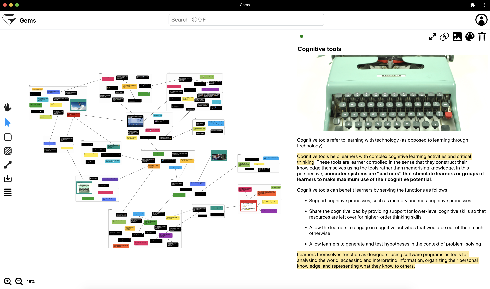

[Gems](https://gemsnotes.app/) is a personal knowledge management tool to explore and connect ideas visually with the help of AI.

The total amount of information in the world is growing exponentially. Information overload is everywhere: on media, in companies, at school, on both our physical desks and digital desktops. There is a hyper-production of content and many contradictory sources available. Finding signals in the noise is becoming increasingly challenging and expensive. In 1982, Richard Buckminster Fuller estimated the knowledge production rate of humankind. In his book "Critical Path" he described the "knowledge doubling curve" by explaining that the rate at which information doubled was getting faster and faster.

Today knowledge workers are drowning in information they don’t have time to process. We save interesting web articles and social posts we rarely revisit. We have messy desktops and folders. We have many books we barely have time to read, let alone interpret and digest. Same for newsletters, videos, podcasts etc. 

If we want to **make sense of this flood of information and make use of it** we currently have two options: 
1. On one side, we have **note-taking tools** and **cloud storage services**. They are built around hierarchical file directories (folders) which are the digital equivalent of the filing cabinets or shelves we had before the existence of computers and software. Back in the early days of personal computers and [GUIs](https://en.wikipedia.org/wiki/Graphical_user_interface), designers needed to make them as familiar as possible to users. So they made [skeuomorphic](https://www.interaction-design.org/literature/topics/skeuomorphism) adaptations of the Desktop, the Trash, etc. Similarly, it felt natural to keep digital information organized as the physical one. It was easier to be adopted by users but the drawback was it didn’t leverage the full potential of the new tool. It’s hard to keep information updated, create cross-references, find patterns, surface ideas, or even just find something in filing cabinets and shelves (the [Zettelkasten of Niklas Luhmann](/article/zettelkasten) is probably the most audacious endeavor in this regard). These limits are reflected in file directories.
2. On the other side, we have **search engines** and **recommender systems** that curate content for us and decide what’s worth our attention. This is a much better experience for navigating large amounts of information. It really takes advantage of the nature of digital content. The drawback is that we no longer see nor have control over the big picture. We have to trust the system on results. Even if algorithms are getting better and better at capturing the semantic meaning of content and matching it with our intents, we miss a lot of context around the retrieved information. Each time we have to build or recall it by relying on our memory which has limited capacity.

So we have challenges in both **information navigability and structure**. We need to find shortcuts to sift through what’s important and worth attention as quickly as possible. But at the same time, we need to do it in a way that fits our mental representations, to preserve context and meaning over time.

Gems is based on such a hybrid approach: 
- It’s built around a **graph visualization**. You can import, create and arrange notes on an infinite whiteboard. You can group notes in nested layers as in folders, but keep references across them with connections. So you have a flexible structure that matches the non-linear way you think to build contextual information instead of siloed containers that don’t talk to each other. 
- In parallel, **AI constantly indexes your knowledge base**. If you need to observe notes from non-trivial angles, such as similarity, you can ask AI to do it for you. You can visually make sense of retrieved results in dedicated views and make updates from there (e.g. connecting two similar notes) which will automatically reflect in the knowledge base. Once you return to the main whiteboard, you will see how the updates fit into the rest of your knowledge structure and you can rearrange some of it accordingly. This helps you review your overall understanding of a topic in light of the new insights suggested by the AI.

Artificial intelligence and human intelligence ultimately solve very different classes of problems. Machines are very good at processing a huge amount of information fast. We are very good at finding meanings, generating new original ideas and making connections between them. The magic happens when we combine the two. Gems captures the semantics of both your brain and AI, the former through the graph visualization, the latter through sophisticated [large language models](https://hai.stanford.edu/news/how-large-language-models-will-transform-science-society-and-ai), and makes them communicate together harmoniously.

Computer science was born with the promise of [extending the human mind with technology](/article/augmented-cognition). Personal computers have kept the promise and now the technology is ready to take that bold vision forward with AI. That’s why I focused my studies on it after graduating in software engineering. Gems brings this power to creators, educators, researchers, journalists, and any other knowledge worker. 

> “I came to the conclusion that if we can advance the knowledge of the world, if we can do things that expand the scope and scale of consciousness, then we’re better able to ask the right questions and become more enlightened. And that’s the only way forward.” – Elon Musk

For more, please visit https://gemsnotes.app/