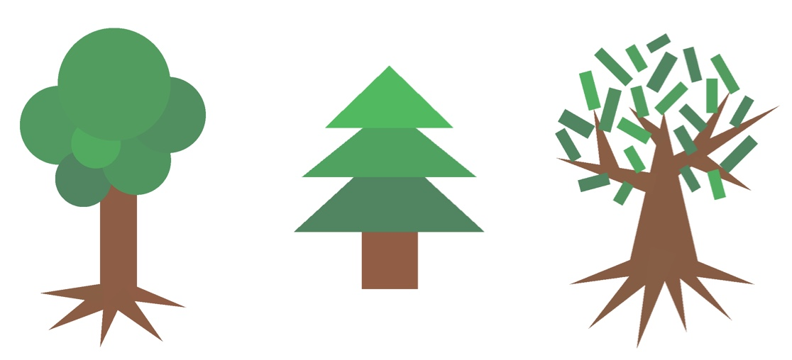

“Shapes” is a **drawing game** with a simple rule: you have to use only rectangles, triangles, and circles to make your compositions. 

<iframe
    title = "An example of what you can do with “Shapes”. The final result is made only with assembled rectangles, triangles, and circles. The soundtrack is original and was made by my brother Leonardo who is a very good music composer."
    src="https://www.youtube-nocookie.com/embed/2iE48A4EvE0?feature=oembed"
    width="560" height="315"
    frameborder="0" 
    allow="accelerometer; autoplay; encrypted-media; gyroscope; picture-in-picture" 
    allowfullscreen
></iframe>

This game was inspired by the work of the Austrian architect **Christopher Alexander**. Starting from the '60s, he has constantly challenged the architectural establishment with revolutionary theories that influenced many other fields. In particular computer science. I've made this game to get people familiar with one of the most fascinating concepts of modern software development coming from Alexander's work: *object-oriented programming*.

## Look beyond what you see
When I was 20, I found in a number of the “*Whole Earth Catalog*” the review of Alexander's book entitled “*Notes on the Synthesis of Form*”. It is a book about the process of design and it is the first he has written in over 50 years of research on the subject. 

> Alexander's “Notes on the Synthesis of Form” was said to be a required reading for researchers in computer science throughout the 1960s. It had an influence in the 1960s and 1970s on programming language design, modular programming, object-oriented programming, software engineering and other design methodologies — Wikipedia

The apps you use every day on your smartphone and PC are mostly built with the object-oriented programming (OOP) paradigm. The key idea is to model the objects of the world into concepts that generalize their properties and behaviors. 

For example, imagine designing an app for rail transport. In this case, the main concepts could be *Train*, *Passenger*, *Ticket*, *Station*. A passenger, for instance, has some properties like name, *address*, *age*, *gender* and is able to perform some actions like *searching for a train*, *booking a ticket*, *going to the station*, etc. A train has its own properties like the *capacity*, *speed*, *departure station* and *arrival station* and actions like *leaving the station*, *opening doors*, *closing doors*, etc. And so forth for every concept. 

By making concepts' properties and behaviors explicit, you are able to discover the underlying relationships among them (e.g A *Passenger* can book a *Ticket*. A *Ticket* is valid for a *Train*. A *Train* has a departure and arrival *Station*, etc.). In OOP, computer programs are made by pieces of code that model these concepts and interact together in order to achieve a goal. 

I've always been fascinated by this way of thinking and I believe that its potential goes far beyond the ability to write code and build apps. Most of the greatest innovations of our time were found at the edge intersection of different fields that apparently had nothing in common. For example, László Bíró invented the ballpoint pen after noticing that a ball that rolls in a puddle leaves a wet strip on the asphalt and he thought that the same principle could also be used for a pen on a paper. 

> His brilliant idea was inspired by accident, but I think that by making the process of finding unexpected relationships among concepts intentional, people can boost their creativity and be more innovative.

This is one of the reasons why I believe that every person should learn how to code. But even to those who are not interested in it, I would like to make them feel the joy of the discovery that comes from it. This is why I made “Shapes”.

The geometric shapes represent the basic objects to start building more complex structures. For example, you can start with the simple representation of a tree as a sequence of triangles for the roots, rectangles for the trunk and circles for the foliage. But this is actually just one possible way to draw it. Someone else perhaps will use a rectangle for the trunk and just one or more stacked triangles to represent the foliage without even taking care of the branches and the roots. And yet another one will use triangles for the trunk, the roots and the branches, and rectangles for the foliage. There are endless possibilities for designing even a simple tree, exactly as it happens when designing software. 

You can start simple, and enjoy creating until you make very complicated draws. At some point, you will find yourself getting more insights from the environment by looking at its components in a systematic way. This may sound mechanistic but it's actually the most creative attitude I've experimented so far. New ideas come to you very easily. Unfortunately, society and our educational system look still far from its adoption. Schools usually present the information sorted by topics, separated by disciplines and generally isolated from other contexts. I think that this severely reduces the chances of making new discoveries. 

The game was designed for kids but can be used at any age. You can try it [here](https://github.com/ittaboba/Shapes).

## WWDC17 Scholarship
I submitted “Shapes” as my first WWDC scholarship application. 

WWDC (Worldwide Developers Conference) is a conference annually held by Apple in California. During the 5 days event, the company showcases its new software and technologies to the developers coming from all over the world. Attendees can participate in hands-on labs with Apple engineers and attend in-depth sessions covering a wide variety of topics.

I dreamed of attending this conference since the day I started studying computer programming in my bedroom. For many years I watched the opening keynote in streaming and took notes on the sessions available online to improve my development skills. 

Tickets and accommodations are expensive and hard to find. But if you are a student you could get a “*golden ticket*” to attend the conference for free. Every year Apple asks students to show their enthusiasm and ingenuity by submitting a personal project made in Swift (the programming language to develop on the Apple platforms) and awards some of them with scholarships.

I designed and developed “Shapes” in a couple of intense weeks. This is the amount of time that Apple usually gives to the applicants. I had no previous experience in game development and the frameworks needed. But as happened during the development of my first app “Volta Pagina”, the combination of time constraints and limited experience on the subject forced me to solve problems quickly and creatively.

> I believe that real creativity happens under constraints of any kind (material, spatial, temporal...). 

“Shapes” itself was inspired by this concept. It is a drawing game in which the user doesn't have a pencil. The tools provided to draw (geometric shapes), force the player to look at the reality in a different way. 

So I submitted the project. Three weeks later I received an email from Apple. I was awarded a scholarship.

It's hard to explain with words what it meant for me to attend WWDC. I took part in other conferences, but nowhere else I felt so much enthusiasm and energy in people's eyes. I had the chance to meet extremely passionate students from all over the world. I did a startup tour with some of them in the days preceding the conference. We met Tim Cook in person, visited the Apple campus and received technical and design insights from the people who made the products we love and use every day. All these experiences, along with many others, have had a profound impact on me both as a person and as a professional and this is something I will never forget. That's why words cannot express all my gratitude to my family who has always supported me, to the startups which kindly welcomed us and to Apple for this incredible opportunity. 