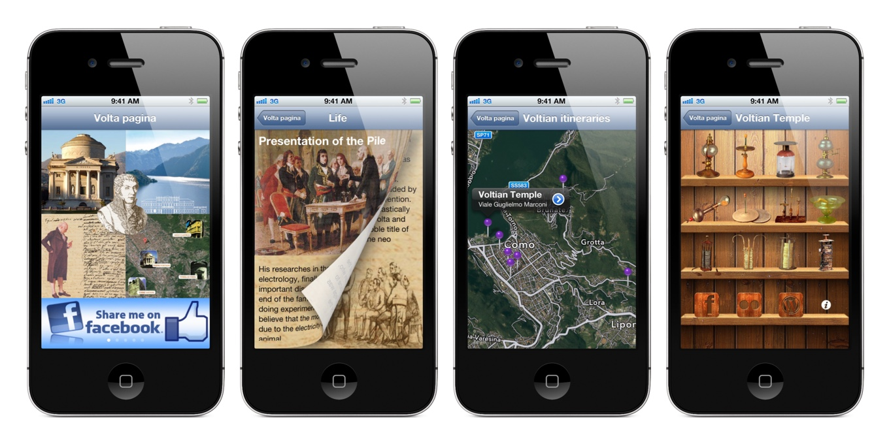

“Volta Pagina” was an iOS app to learn about **Alessandro Volta**'s life and studies. He was a physicist from Como (my home town) and he is famous for inventing the battery. Albert Einstein defined it as “*the fundamental basis of all modern innovations*”.

In 1799, Volta tested his idea with a stack of alternating layers of zinc and copper separated by paper soaked in a saltwater solution. The electric current flowed through a wire applied to both ends of the pile. He also discovered that it was possible to change the electric potential difference between the two ends by using different metals. This is why the standard unit of electric potential is named “**Volt**”.

<iframe
  title="How batteries work (TED-Ed / YouTube)"
  src="https://www.youtube-nocookie.com/embed/9OVtk6G2TnQ?feature=oembed"
  width="560" height="315"
  frameborder="0" 
  allow="accelerometer; autoplay; encrypted-media; gyroscope; picture-in-picture" 
  allowfullscreen
></iframe>

Before inventing the battery Volta improved the electrophorus, a device used to generate static electricity by means of induction. A few years later, by observing some physical properties of it, he created the capacitor to store electrical energy. It is still a fundamental component of all our electronic devices. He made many other inventions, theories, and discoveries that revolutionized the knowledge at the time on electrical phenomena. But Volta's genius and curiosity didn't stop there.

During his summer holidays on Lake Maggiore in 1776, while he was on a boat along a reed bed, he saw gaseous bubbles coming to the surface and then disappearing into the air. By analyzing the air produced, he discovered that it was flammable and he called it “flammable swamp air” which later became known as methane. In one of his letters, he suggested replacing the use of oil as a fuel for the lamps with gas from the swamps. These new lamps, called “perpetual lamps” or “Volta lamps”, made its inventor the precursor of gas lightning. The principle of their operation was then extended to the lighter.

> Volta's work had a profound impact on our hyper technological society and daily lives. Many of the greatest innovations happened in the past three centuries wouldn't have been possible without him. Furthermore, he envisioned and laid the foundations for a world driven by sustainable energy and renewable resources at the end of the 18th century.

## First app
“Volta pagina” was designed to inspire the user through Volta's life and discoveries. 

The “Biography” section was about Volta's adventurous life events. He was considered a kid with learning problems as he didn't speak fluently until the age of 7. At that same age, he began to reveal a lively curiosity towards natural phenomena. He risked drowning in the source of Monteverde, near Camnago, trying to find some gold specks. He wrote his first scientific memory “*De vi attractiva ignis electrici, ac phaenomenis inde pendentibus*” at 24. In 1778 he became a physics professor in Pavia and his classes were so crowded that it was necessary the construction of a larger physics theater. He was very open to different cultures and perspectives and he visited many European countries, something unusual for the time.

In the “Voltian itineraries” section there were all the relevant places and monuments dedicated to him in the city of Como. For example “Torre Gattoni”, a tower in the inner corner of the city walls where he made his experiments in the laboratory of his friend Cesare Gattoni. The app could guide the visitor to each location and provide information.

I would have loved to do something similar inside the Voltian Temple too, the museum that houses Volta's instruments and documents. I designed a tour based on beacons, small bluetooth radio transmitters used inside indoor spaces to deliver contextual information on your smartphone once you are nearby specific objects. I proved the feasibility by making a working demo. Unfortunately, it wasn't possible to get permission to put the hardware inside the building. Still, the “Voltian Temple” section included the descriptions of his most important inventions and discoveries.

Many other online resources and contributions were directly reachable from the app. Social media sharing features were available too.

The app was in English and Italian. It was downloaded in more than 30 countries from every continent. Today it is no longer available on the App Store but I still consider it one of the most important milestones for me both as a professional and as a person.

## Anyone can code
“Volta Pagina” was the first app I did and published on the App Store when I was 17. There was a contest among Como high schools to promote the figure of the great scientist. At the time I was still in my early days as a developer and the choice to make a real app in time for the deadline was bold. But it turned out to be a life-changing experience.

I remember spending countless hours improving design and code quality over and over again. I restarted from scratch twice as I was not satisfied with the results. I felt happy, angry, excited, frustrated and elated along the way. Meanwhile, my ideas were taking shape on the screen exactly as I imagined them. It was creative and empowering.

> By making this app I realized something that changed my perspective: my generation is the first to have the chance to imagine, build and share an idea with the world. For many centuries it has been a privilege reserved for the richest and most powerful people. Today everyone can do it almost for free and directly from their bedroom. I promised myself not to waste such an opportunity.

It is a privilege and a responsibility to live in a century which offers these kinds of opportunities. The Internet is the largest and most accessible knowledge source in human history. Computers' power is now able to sustain our darest ambitions at an affordable cost. In the near future, we will extend our creative and cognitive capabilities with the help of artificial intelligence. I believe that computer programming is an essential skill for anyone who wants to make the most of this potential. I'm not talking about employability either the next billionaire startup. Algorithms already influence our choices far more than we can imagine and it is extremely important to understand how they work to make conscious decisions.

> “What I cannot create, I do not understand” — Richard Feynman

That’s what was on Nobel-Prize winning physicist's blackboard when he died. He always believed in the importance of reformulating concepts in a simple and personal way to fully grasp their meaning. Writing an algorithm is a great exercise in this regard. To tell a machine how to solve a problem, you must first have solved it in your mind. Then you must have broken down and formalized every single step you have taken to reach the solution. Only at that point, it is possible to write the sequence of instructions to be performed by the machine to complete the task. Namely an algorithm.

> Our world is run by algorithms. So being able to code means knowing the operating principles of the system we live in. Furthermore, it also gives us the opportunity to understand reality on a deeper level.

If we want to build inclusive technologies, if we want to prevent a small number of people from keeping all this immense power for themselves, if we want to unleash a new wave of groundbreaking innovations like Alessandro Volta did, we need as many people as possible who know how technology really works by learning how to code.