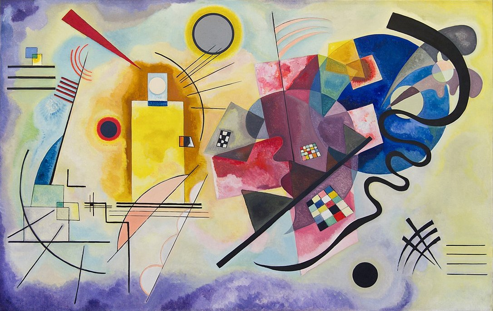
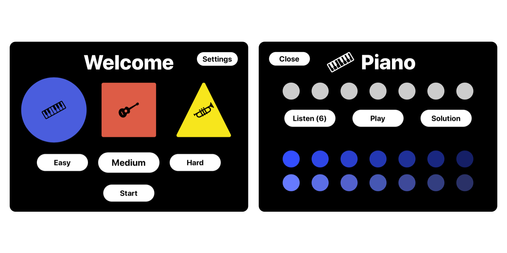

“Waves” is a musical game to train aural and synesthetic perceptions: the player must recreate the same sequence of notes randomly generated by the software.

<iframe
    title = "An example of an easy level played with the trumpet. You can set a shape and color for each musical instrument. The association is strengthened by playing several times until each sound is perceived synesthetically."
    src="https://www.youtube-nocookie.com/embed/EWRN-fiN3SE?feature=oembed"
    width="560" height="315"
    frameborder="0" 
    allow="accelerometer; autoplay; encrypted-media; gyroscope; picture-in-picture" 
    allowfullscreen
></iframe>

**This game explores the associations between sounds, shapes, and colors**. It was deeply influenced by my previous experiences with “[Shapes](/article/5e2f57472709b8142b01147b)” and “[Dots](/article/5e598c062709b8142b01147d)”. Truth be told, those games were focused only on sight since I am not very familiar with music in general. However, I was intrigued by the potential of these three elements put together, so I decided to challenge myself.

## The symphony of colors
Synesthesia, or “joined perception” from the Greek word *syn* meaning “join” and *aisthesis* meaning “perception”, is a neurological condition in which the person experiences a combination of the senses. For example, synesthetes can smell colors, see music, or listen to a painting. Exposed to certain stimuli, these people cross-activate adjacent areas of the brain to process different sensory information together. 

<iframe
    title = "What color is Tuesday? Exploring synesthesia - TedEd"
    src="https://www.youtube-nocookie.com/embed/rkRbebvoYqI?feature=oembed"
    width="560" height="315"
    frameborder="0" 
    allow="accelerometer; autoplay; encrypted-media; gyroscope; picture-in-picture" 
    allowfullscreen
></iframe>

Potentially, we are all synesthetes. However, only 4% of us regularly experience it. What happens to the others? When I was a child, I got familiar with the alphabet by playing with colored letters. Then I went to school and I learned to read and write mostly in black characters for the rest of my life. I guess you followed pretty much the same path. The problem is that in our daily lives we tend to harness our minds in repetitive tasks. In this way, our brain strengthens some connections to always process particular information in the same way. We do it for convenience, to be more efficient at work and study for example. The brain loves it because we allow it to be faster and save energy. The drawback is that we lose our innate ability to perceive things in a multisensory way as when we were children. Just very few people continue seeing letters, numbers, and words in colors even when they are printed in black. Many of them are poets and artists. One in particular deeply influenced this work and my interest in art in general.

**Wassily Kandinsky** is considered the founder of abstract art. Colors' relationships with shapes and sounds are the core concept to understand his paintings. Unlike most of the previous theories on color, he was not interested in the physical properties of the spectrum, but only in the emotional response that colors arouse in the viewer's soul. **Colors have a spiritual meaning like musical sounds**. So he compared each with a musical instrument. For example, yellow is very irrational like the sound of a trumpet. Red is warm like a tuba. Light blue is calm and reminds to a flute while dark blue is deep and intense like a cello. 

Furthermore, he thought that colors could get more or less emotional intensity depending on the shape they were associated with. **Each color has a privileged shape that emphasizes its expressive power**. In the 20s, Kandinsky was a teacher at the Bauhaus in Weimar and focused his lessons on chromatic composition. One day he asked his students to associate the triangle, the square, and the circle to the three primary colors. Most of them associated yellow to the triangle, red to the square, and blue to the circle. According to this result, Kandinsky painted “*Yellow, red, blue*”, one of his most famous masterpieces. 

Kandinsky was clearly a synesthete who looked at art in a very different way. He introduced a new conception of beauty based on the expression of an inner need rather than a commonly accepted aesthetic principle. A creative process very close to musical improvisation. These principles inspired “Waves”.

> “The artist must have something to say, for mastery over form is not his goal but rather the adapting of form to its inner meaning” 
>
> — Wassily Kandinsky 

## The Game
People with synesthesia see the world very differently. Many scientists, composers, and artists, including **Leonardo Da Vinci**, have described their experiences with it. Although some people think it is a rare and innate skill, synesthesia can be strengthened by repeated exposure to combined perceptual features at key developmental stages and can lead to remarkable cognitive abilities, including creativity and memory.

There are over 80 different types of synesthesia described by science. “Waves” was designed to train *Chromesthesia* or *sound-to-color synesthesia*, that is, a sound that simultaneously evokes a chromatic experience. Kandinsky actually used it in creating his paintings. 

When you launch the game, you can choose between three musical instruments to play with: Piano, Guitar, or Trumpet. As with Kandinsky's paintings, each of them is associated with a color and a shape. The default values are set according to my personal perception. Of course, since the aim of the game is to strengthen your associations which likely differ from mine, you can customize everything on the *Settings* page.

After setting up the instruments, you are ready to play. The software randomly generates a sequence of notes that you must recreate by picking the right ones from a musical scale. Each note of the scale is colored with different brightness and saturation according to its pitch. You can listen to the original sequence a limited number of times which varies depending on the difficulty of the level. You win the game if you match the sequence within this limit. You can try and experiment with the notes of the scale as many times as you want. 

The game can be used by everyone but it is designed for kids in particular. During childhood, our brains are overly connected. Then as we grow up, many of the unneeded connections are pruned away. This means that most of us started out with some degree of synesthesia, which faded away with normal development. I hope that by playing this game, kids can limit this loss by having fun. Furthermore, some studies have shown that this kind of repeated associative learning works for adults as well. The game is also useful for ear training. Another important skill, especially if you are a musician. You can try it [here](https://github.com/ittaboba/Waves).

## WWDC19 Submission
“Waves” was my third and last submission to attend [WWDC](https://en.wikipedia.org/wiki/Apple_Worldwide_Developers_Conference) as a student. Unfortunately, after two consecutive scholarships, it was rejected. 

I made it without compromise. I accepted the risks coming from my technical inexperience with everything related to music, which is a relevant part of this project. I simply took it as an opportunity to deepen a topic I was interested in. At the university, I have always studied for the joy of learning rather than for good grades. In the same way, I have always designed and developed my submissions to experiment without thinking too much about the judgment criteria. It was two intense weeks and I had a lot of fun. No regrets.

If you are a student who enjoys developing iOS apps, you should definitely apply. It is one of those rare occasions to discover powers that you never thought you would have.

> “Whatever you can do or dream you can, begin it. Boldness has genius, power, and magic in it.” 
>
> — Johann Wolfgang von Goethe